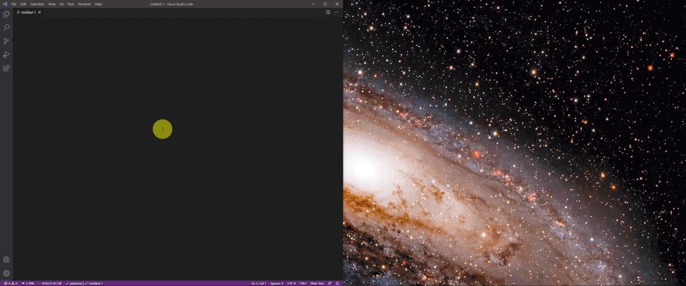

# UltraDocker

This is a simple AutoHotkey script for easy docking of windows, aimed primarily at ultrawide monitors, with aspect ratio 21:9 or higher.

## Basic usage

Install [AutoHotkey](https://www.autohotkey.com/) on your Windows system and run the file `UltraDocker.ahk`. By default, the script is triggered using either of the following two ways:

* On the keyboard: Caps Lock. I found that this is the key that makes the most sense, as it exists on both desktop and laptop keyboards, but is never actually used in practice. If you do want to use Caps Lock (e.g. to shout at people on the Internet), simply press Shift + Caps Lock.
* On the mouse: The "Mouse 4" button, available in most gaming mice. If you do not have a mouse with 4 or more buttons, use the keyboard trigger instead.

When the trigger button or key is pressed, the currently active window will be docked based on the current location of the mouse. If the window is maximized, it will be un-maximized first.

* Horizontally:
    * If the mouse is in the **left or right third** of the screen, the window will be docked to the left or right respectively, at **50%** of the total width of the screen. This allows docking one window to the left and one to the right, so they can be used in parallel.
    * If the mouse is in the **middle third** of the screen, the window will be centered at **60%** of the total width of the screen. This allows having only one window open on the screen, in a convenient location, but without maximizing the window, which often makes it too wide; for example, when using a web browser or a text editor, it is very inconvenient to have the text extend all the way across the screen.
* Vertically:
    * If the mouse is in the **middle 70%** of the screen, the window will take the **full height** of the screen. This is probably the option you will be using most of the time, and it allows 2 windows to be docked side-by-side.
    * If the mouse is in the **top or bottom 15%** of the screen, the window will be docked to the top or bottom respectively, at **50%** of the total height of the screen. Use this if you want to dock one window to the top and one to the bottom on each side of the screen, so that up to 4 windows can be used in parallel.

See the video below for a demonstration. Note that the video only shows full-height docking.



## 16:9 mode

Optionally, adding the Ctrl key to the trigger, that is, Ctrl + Caps Lock or Ctrl + Mouse 4, will enable 16:9 mode. The window will then be resized while maintaining a 16:9 aspect ratio, e.g. for screen sharing.

Enabling 16:9 mode while the mouse is within 10% of the center of the screen will resize the window to full height, to achieve the maximum window size possible, while maintaining a 16:9 aspect ratio.

## Changing the trigger keys

The trigger keys are defined in the following 4 lines of the source code:

```none
CapsLock::
^CapsLock::
XButton1::
^XButton1::
```

To change the keys, replace either `CapsLock` or `XButton1` with another key from [the list of available AutoHotkey keys](https://www.autohotkey.com/docs/KeyList.htm). Be sure to replace both instances of the key (the one that begins with `^` is the key modified by Ctrl).

## Running as administrator and/or on startup

The script will only be able to dock administrative applications (e.g. Registry Editor) if you run the script itself as administrator. Simply right-click on the script and choose "Run as administrator" from the menu.

To run the script automatically on startup, either create a shortcut to it in `%APPDATA%\Microsoft\Windows\Start Menu\Programs\Startup` or create a task for it in the Task Scheduler. The latter option is preferred, as it allows you to run the script as administrator on startup without the hassle of the User Account Control (UAC) prompt.

## Version history

* v2.0.0 (2021-09-27)
    * Added the option to dock the windows to the top or bottom and/or at 16:9 aspect ratio.
* v1.0 (2021-04-12)
    * Initial release.

## Feedback

If you would like a request any additional features, or if you encounter any bugs, please feel free to open a new issue!

## Author and copyright

Copyright (c) 2021 [Barak Shoshany](http://baraksh.com) (baraksh@gmail.com). Licensed under the [MIT license](LICENSE.txt).
